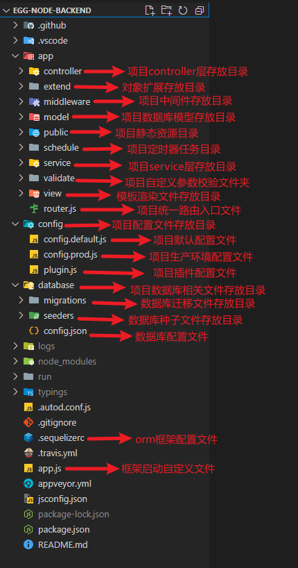

# egg-node-backgen

## 介绍

基于 node.js 的 egg 后端管理模板
参考文档 https://www.eggjs.org/zh-CN/intro

## 项目目录结构介绍

## 使用教程：

### 环境要求：node.js >= 18.0.0

### 开发环境启动步骤

1. 使用命令 npm install 下载项目所需依赖
2. 使用命令 npm run db-create-dev 创建 dev 环境的数据库
3. 使用命令 npm run db-migrate-dev 初始化 dev 环境数据库表
4. 使用命令 npm run db-seed-dev 初始化数据库表基础数据
5. 使用命令 npm run dev 启动 dev 环境项目

### 生产环境启动步骤

2. 使用命令 npm run db-create-prod 创建 dprod 环境的数据库
3. 使用命令 npm run db-migrate-prod 初始化 prod 环境数据库表
4. 使用命令 npm run db-seed-prod 初始化数据库表基础数据
5. 使用命令 npm run start 启动 prod 环境项目

### 参与贡献

1.  Fork 本仓库
2.  新建 Feat_xxx 分支
3.  提交代码
4.  新建 Pull Request

## 通用接口 list 查询说明
### 通用查询参数

\_\_attributes 可空；只返回的字段；逗号分隔多个，Eg： "id,name,age"

\_attributesExclude 可空；除这些字段外，都返回；优先级高于\_attributes；逗号分隔多个,Eg： "id,name,age"

\_limit ( 查询数量限制，可为空，默认为 1000 )

\_offset( 表示从哪一处开始查询数据，可为空，默认为 0 )

\_countOnly ( 是否只返回总数， 可空；当值为"true"是，不返回 data，只返回 count )

\_order （ 排序规则，可空；默认按照 CreateAt 字段排序 ）

\_foreignFiled 可空；用于获取一个外联表的字段；值 当前表的字段名（外键 id）,外联表 Model 名，外联表 Field 名，绑定到当前对象上的名称

例如：  currentTableFiled,OtherTableName,otherTableNameFiled,asCurrentTableFiled

解释：
（ currentTableFiled 表示当前表的某个字段名，且属于 OtherTableName 表的一个外键，otherTableNameFiled 表示要获取其他表的某个字段名，asCurrentTableFiled 表示将获取到的 otherTableNameFiled 字段作为当前表的某个字段名。）

### json 字段查询，支持 a.b
默认 key，value 模式；key 对应字段；json 字段支持 key 值使用 a.b 的形式；

### 高级查询方法
支持如下运算符号。目标字段与运算法之间用","分隔；
同一个字段，可以多个运算符组合使用。

例如查询某时间段的数据 dataTime,gt=2022-01&dataTime,lte=2022-02

eq = 3

ne != 20

gt > 6

gte >= 6

lt < 10

lte <= 10

in IN [1, 2]

like LIKE '%hat'

startsWith LIKE 'hat%'

endsWith LIKE '%hat'

substring LIKE '%hat%'

## 数据库迁移插件 sequelize-cli 命令

sequelize db:migrate                            备注：Run pending migrations

sequelize db:migrate:schema:timestamps:add    备注：Update migration table to have timestamps

sequelize db:migrate:status                   备注：List the status of all migrations

sequelize db:migrate:undo                     备注：Reverts a migration

sequelize db:migrate:undo:all                 备注：Revert all migrations ran

sequelize db:seed                             备注：Run specified seeder

sequelize db:seed:undo                        备注：Deletes data from the database

sequelize db:seed:all                         备注：Run every seeder

sequelize db:seed:undo:all                    备注：Deletes data from the database

sequelize db:create                           备注：Create database specified by configuration

sequelize db:drop                             备注：Drop database specified by configuration

sequelize init                                备注：Initializes project

sequelize init:config                         备注：Initializes configuration

sequelize init:migrations                     备注：Initializes migrations

sequelize init:models                         备注：Initializes models

sequelize init:seeders                        备注：Initializes seeders

sequelize migration:generate                  备注：Generates a new migration file

sequelize migration:create                    备注：Generates a new migration file

sequelize model:generate                      备注：Generates a model and its migration

sequelize seed:generate                       备注：Generates a new seed file

sequelize seed:create                         备注：Generates a new seed file